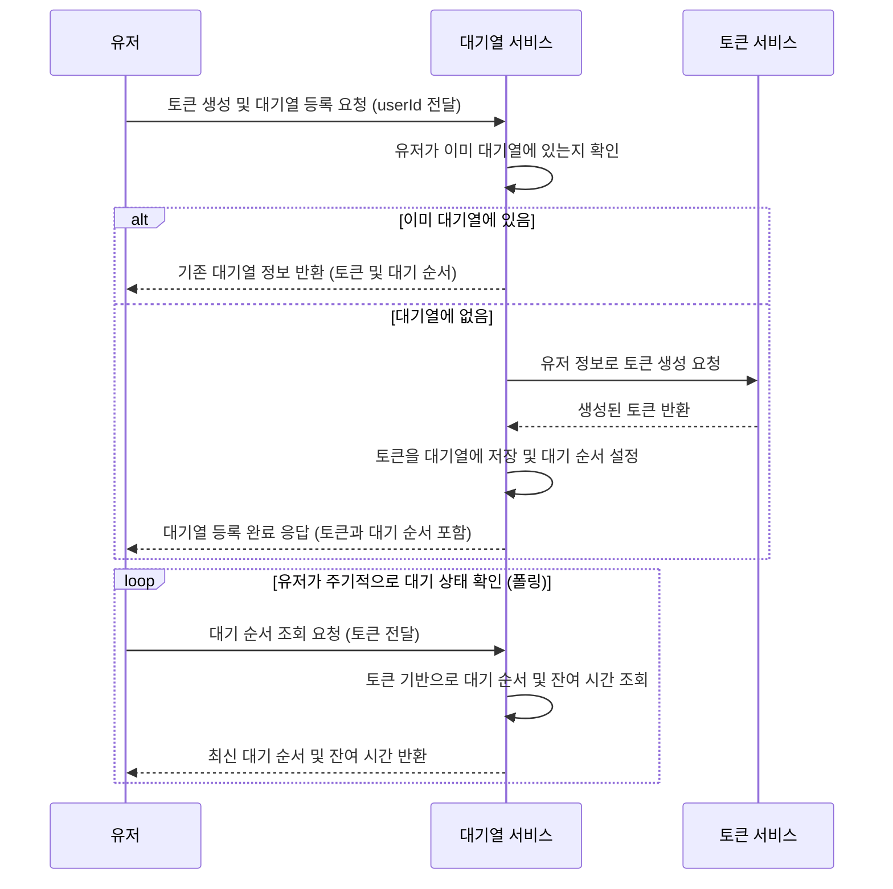
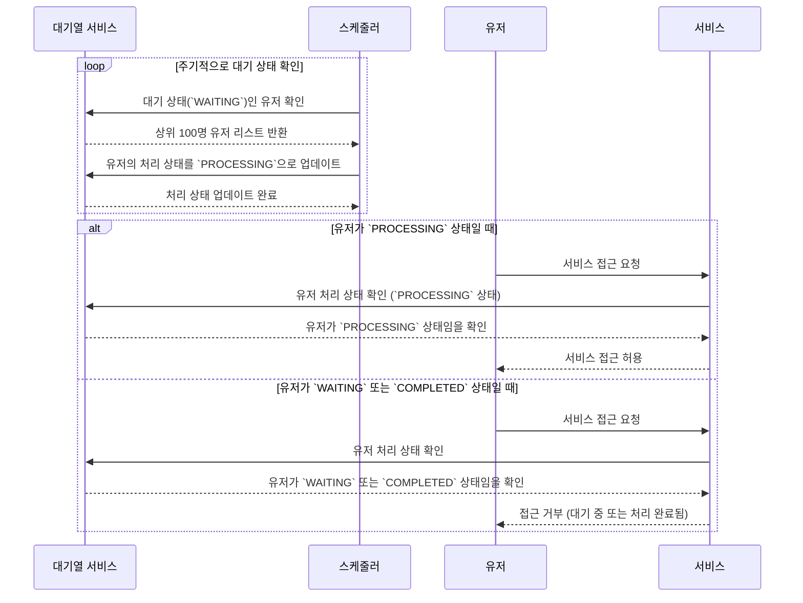
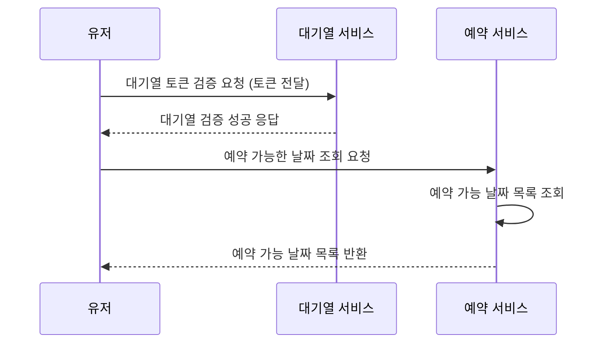
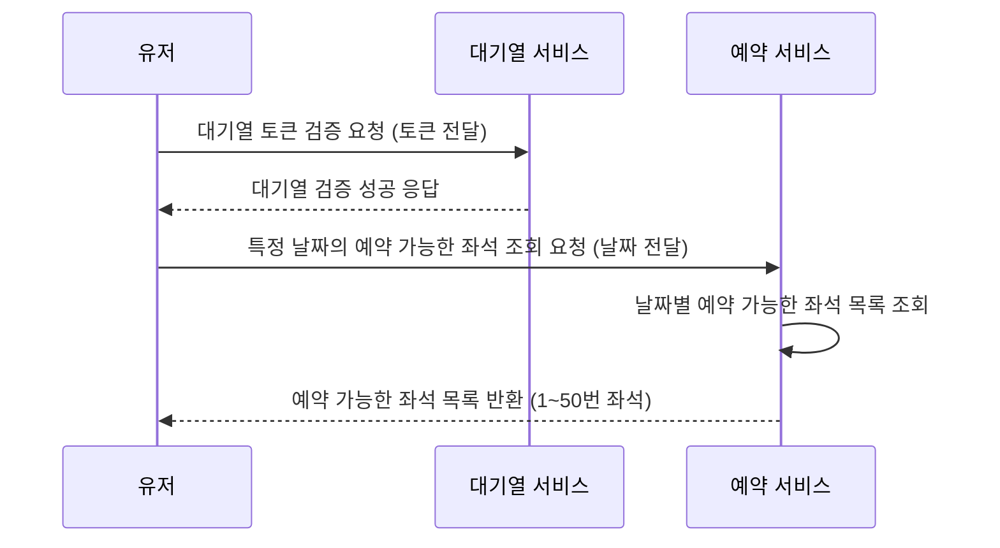
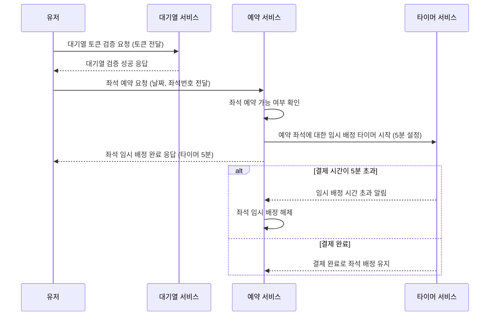
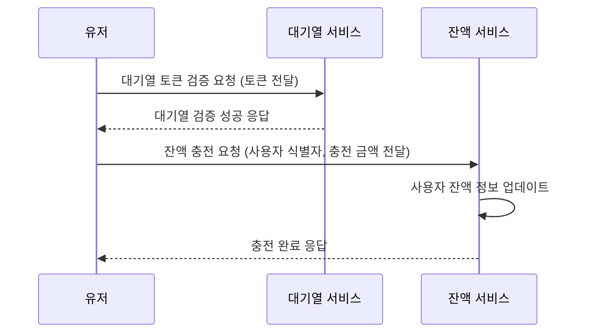
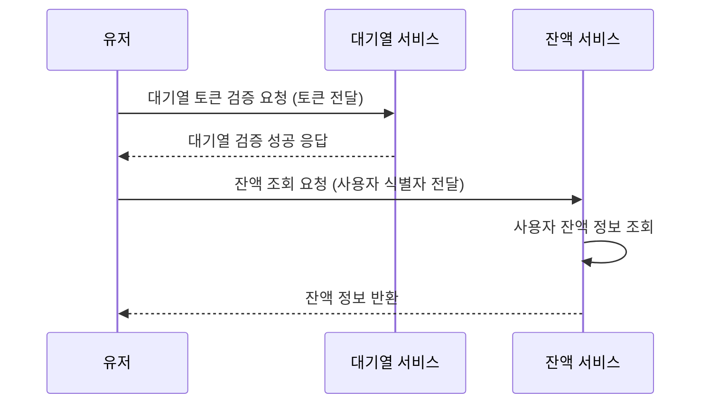
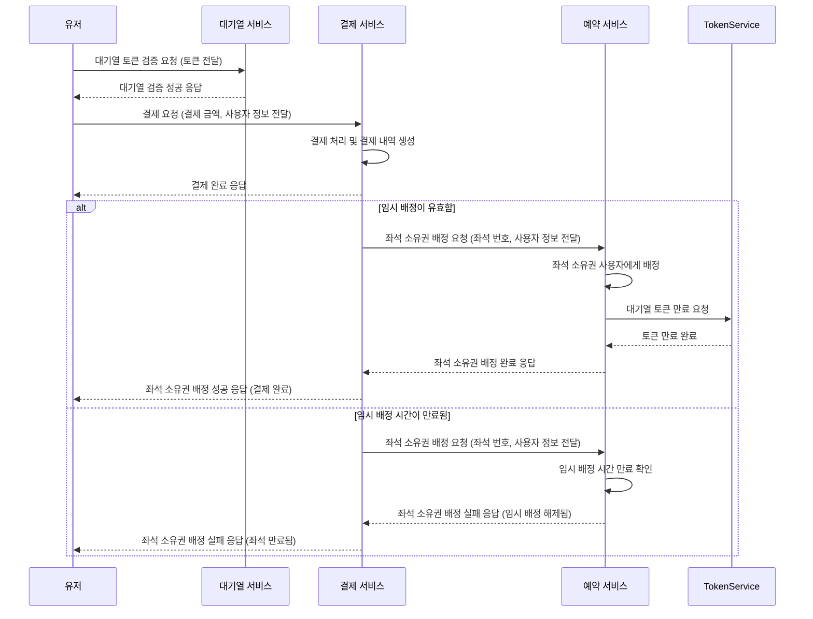

## 시퀀스 다이어 그램

### 유저 대기열 토큰 기능

```mermaid
sequenceDiagram
    participant User as 유저
    participant QueueService as 대기열 서비스
    participant TokenService as 토큰 서비스

    User->>QueueService: 토큰 생성 및 대기열 등록 요청 (userId 전달)
    QueueService->>QueueService: 유저가 이미 대기열에 있는지 확인
    alt 이미 대기열에 있음
        QueueService-->>User: 기존 대기열 정보 반환 (토큰 및 대기 순서)
    else 대기열에 없음
        QueueService->>TokenService: 유저 정보로 토큰 생성 요청
        TokenService-->>QueueService: 생성된 토큰 반환
        QueueService->>QueueService: 토큰을 대기열에 저장 및 대기 순서 설정
        QueueService-->>User: 대기열 등록 완료 응답 (토큰과 대기 순서 포함)
    end

    loop 유저가 주기적으로 대기 상태 확인 (폴링)
        User->>QueueService: 대기 순서 조회 요청 (토큰 전달)
        QueueService->>QueueService: 토큰 기반으로 대기 순서 및 잔여 시간 조회
        QueueService-->>User: 최신 대기 순서 및 잔여 시간 반환
    end

```

### 대기열에서 처리 상태 관리

```mermaid
sequenceDiagram
    participant QueueService as 대기열 서비스
    participant Scheduler as 스케줄러
    participant User as 유저
    participant Service as 서비스

    loop 주기적으로 대기 상태 확인
        Scheduler->>QueueService: 대기 상태(`WAITING`)인 유저 확인
        QueueService-->>Scheduler: 상위 100명 유저 리스트 반환
        Scheduler->>QueueService: 유저의 처리 상태를 `PROCESSING`으로 업데이트
        QueueService-->>Scheduler: 처리 상태 업데이트 완료
    end

    alt 유저가 `PROCESSING` 상태일 때
        User->>Service: 서비스 접근 요청
        Service->>QueueService: 유저 처리 상태 확인 (`PROCESSING` 상태)
        QueueService-->>Service: 유저가 `PROCESSING` 상태임을 확인
        Service-->>User: 서비스 접근 허용
    else 유저가 `WAITING` 또는 `COMPLETED` 상태일 때
        User->>Service: 서비스 접근 요청
        Service->>QueueService: 유저 처리 상태 확인
        QueueService-->>Service: 유저가 `WAITING` 또는 `COMPLETED` 상태임을 확인
        Service-->>User: 접근 거부 (대기 중 또는 처리 완료됨)
    end
```

### 예약 가능 날짜 조회

```mermaid
sequenceDiagram
    participant User as 유저
    participant QueueService as 대기열 서비스
    participant ReservationService as 예약 서비스

    User->>QueueService: 대기열 토큰 검증 요청 (토큰 전달)
    QueueService-->>User: 대기열 검증 성공 응답
    User->>ReservationService: 예약 가능한 날짜 조회 요청
    ReservationService->>ReservationService: 예약 가능 날짜 목록 조회
    ReservationService-->>User: 예약 가능 날짜 목록 반환

```

### 특정 날짜에 예약 가능한 좌석 조회

```mermaid
sequenceDiagram
    participant User as 유저
    participant QueueService as 대기열 서비스
    participant ReservationService as 예약 서비스

    User->>QueueService: 대기열 토큰 검증 요청 (토큰 전달)
    QueueService-->>User: 대기열 검증 성공 응답
    User->>ReservationService: 특정 날짜의 예약 가능한 좌석 조회 요청 (날짜 전달)
    ReservationService->>ReservationService: 날짜별 예약 가능한 좌석 목록 조회
    ReservationService-->>User: 예약 가능한 좌석 목록 반환 (1~50번 좌석)

```

### 좌석 예약 요청

```mermaid
sequenceDiagram
    participant User as 유저
    participant QueueService as 대기열 서비스
    participant ReservationService as 예약 서비스
    participant TimerService as 타이머 서비스

    User->>QueueService: 대기열 토큰 검증 요청 (토큰 전달)
    QueueService-->>User: 대기열 검증 성공 응답
    User->>ReservationService: 좌석 예약 요청 (날짜, 좌석번호 전달)
    ReservationService->>ReservationService: 좌석 예약 가능 여부 확인
    ReservationService->>TimerService: 예약 좌석에 대한 임시 배정 타이머 시작 (5분 설정)
    ReservationService-->>User: 좌석 임시 배정 완료 응답 (타이머 5분)

    alt 결제 시간이 5분 초과
        TimerService-->>ReservationService: 임시 배정 시간 초과 알림
        ReservationService->>ReservationService: 좌석 임시 배정 해제
    else 결제 완료
        TimerService-->>ReservationService: 결제 완료로 좌석 배정 유지
    end

```

### 잔액 충전

```mermaid
sequenceDiagram
    participant User as 유저
    participant QueueService as 대기열 서비스
    participant BalanceService as 잔액 서비스

    User->>QueueService: 대기열 토큰 검증 요청 (토큰 전달)
    QueueService-->>User: 대기열 검증 성공 응답
    User->>BalanceService: 잔액 충전 요청 (사용자 식별자, 충전 금액 전달)
    BalanceService->>BalanceService: 사용자 잔액 정보 업데이트
    BalanceService-->>User: 충전 완료 응답
```

### 잔액 조회

```mermaid
sequenceDiagram
    participant User as 유저
    participant QueueService as 대기열 서비스
    participant BalanceService as 잔액 서비스

    User->>QueueService: 대기열 토큰 검증 요청 (토큰 전달)
    QueueService-->>User: 대기열 검증 성공 응답
    User->>BalanceService: 잔액 조회 요청 (사용자 식별자 전달)
    BalanceService->>BalanceService: 사용자 잔액 정보 조회
    BalanceService-->>User: 잔액 정보 반환
```

### 결제

```mermaid
sequenceDiagram
    participant User as 유저
    participant QueueService as 대기열 서비스
    participant PaymentService as 결제 서비스
    participant ReservationService as 예약 서비스

    User->>QueueService: 대기열 토큰 검증 요청 (토큰 전달)
    QueueService-->>User: 대기열 검증 성공 응답
    User->>PaymentService: 결제 요청 (결제 금액, 사용자 정보 전달)
    PaymentService->>PaymentService: 결제 처리 및 결제 내역 생성
    PaymentService-->>User: 결제 완료 응답

    alt 임시 배정이 유효함
        PaymentService->>ReservationService: 좌석 소유권 배정 요청 (좌석 번호, 사용자 정보 전달)
        ReservationService->>ReservationService: 좌석 소유권 사용자에게 배정
        ReservationService->>TokenService: 대기열 토큰 만료 요청
        TokenService-->>ReservationService: 토큰 만료 완료
        ReservationService-->>PaymentService: 좌석 소유권 배정 완료 응답
        PaymentService-->>User: 좌석 소유권 배정 성공 응답 (결제 완료)
    else 임시 배정 시간이 만료됨
        PaymentService->>ReservationService: 좌석 소유권 배정 요청 (좌석 번호, 사용자 정보 전달)
        ReservationService->>ReservationService: 임시 배정 시간 만료 확인
        ReservationService-->>PaymentService: 좌석 소유권 배정 실패 응답 (임시 배정 해제됨)
        PaymentService-->>User: 좌석 소유권 배정 실패 응답 (좌석 만료됨)
    end
```

