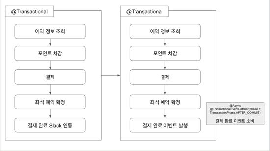

# 💡 비즈니스 로직 및 트랜잭션 범위 최적화 방안
비즈니스 로직이 복잡해지고 트랜잭션 범위가 넓어지면 성능 문제와 안정성 문제가 발생할 수 있다.  
특히 외부 시스템과 연동할 때 트랜잭션에 미치는 영향을 최소화하는 것이 중요하다. 이를 위한 최적화 방법을 아래와 같이 정리해보았다.

---

## 1️⃣ 트랜잭션 범위 줄이기
트랜잭션이 너무 많은 작업을 포함하면 대기 시간이 길어지고 데드락이 발생할 가능성이 커진다.  
특히 트랜잭션 내에서 외부 시스템과의 연동 작업이 포함되면 불필요한 리소스 사용이 많아져 성능이 떨어질 수 있다.

**해결 방법**:  
트랜잭션 범위를 핵심 DB 작업으로 한정하고 외부 작업은 비동기나 별도 트랜잭션으로 처리하는 것이 좋다.

---

## 2️⃣ 외부 시스템 연동 시 트랜잭션과 분리
트랜잭션 내에서 외부 API 호출이나 파일 작업 등을 처리하면, 외부 작업의 지연으로 트랜잭션이 길어지고 리소스 소모가 커질 수 있다.  
외부 API가 실패할 경우 트랜잭션 전체가 롤백되어 불필요한 재시도가 생길 수 있다.

**해결 방법**: 
외부 시스템 연동은 트랜잭션이 끝난 후 별도로 실행되도록 설정한다.  
Spring의 @TransactionalEventListener`을 사용하여 트랜잭션이 커밋된 후에 외부 시스템 작업을 처리하도록 할 수 있다.

- **효과**: 트랜잭션 성공 이후에만 외부 연동 작업을 실행하여, 외부 시스템 연동 실패가 주 트랜잭션에 영향을 주지 않도록 할 수 있다.

---

## 3️⃣ 애플리케이션 이벤트를 사용해 관심사 분리

**문제점**: 
비즈니스 로직이 다양한 책임을 가질수록 유지보수가 어려워질 수 있다.

**해결 방법**:
`ApplicationEvent` 구조를 사용해 비즈니스 로직을 독립적인 단위로 나누고, 관심사별로 이벤트 발행과 구독을 통해 처리가 가능하도록 한다.

- **구현 예시**: 결제 프로세스 완료 후, 결제 성공 이벤트를 발행해 후속 작업을 비동기로 처리한다. `@Async`와 `@TransactionalEventListener`를 조합해 트랜잭션 커밋 후 비동기적으로 외부 시스템에 전송 작업을 수행할 수 있다.
- **효과**: 이벤트 기반 구조를 통해 비즈니스 로직의 결합도를 낮추고, 특정 작업이 실패해도 다른 로직에 영향을 주지 않도록 할 수 있다.

위 이미지에서 왼쪽은 트랜잭션 내부에서 외부 연동을 수행하는 구조로, 외부 시스템의 응답 지연이나 실패가 전체 트랜잭션에 영향을 미칠 수 있는 형태다.  
반면, 오른쪽은 이벤트를 발행하여 트랜잭션과 외부 연동 작업을 분리한 구조로, 트랜잭션이 커밋된 후에만 외부 연동 작업이 시작된다.  
이를 통해 트랜잭션의 범위를 최소화하고, 주요 트랜잭션과 외부 작업 간의 결합도를 줄임으로써 성능과 안정성을 동시에 확보할 수 있다.

# 🌐 MSA(마이크로서비스 아키텍처)의 등장 배경

MSA(Microservices Architecture)는 기존의 **모놀리식 아키텍처**의 한계를 해결하기 위해 등장한 아키텍처이다  
특히, 클라우드 컴퓨팅과 **AWS(Amazon Web Services)**와 같은 클라우드 제공업체의 성장이 MSA의 도입을 더욱 가속화하였다.  
이를 이해하기 위해 모놀리식 아키텍처와 MSA의 차이점을 설명하고자 한다.

---

## 🔷 모놀리식 아키텍처란?

**모놀리식 아키텍처**는 모든 기능이 하나의 통합된 애플리케이션으로 배포되고 실행되며, 단일 아키텍처가 전체 시스템을 관리한다.

- **특징**:
    - 하나의 코드베이스에 모든 기능이 포함됨
    - 단일 배포 단위로, 모든 기능이 함께 배포되고 업데이트됨
    - 단순한 시스템 설정 및 배포 과정

- **장점**:
    - 개발 초기에는 구조가 단순해 개발 속도가 빠름
    - 모든 기능이 한 곳에 있어 테스트와 배포가 간단함

- **단점**:
    - 애플리케이션이 커질수록 코드 관리와 배포가 어려워짐
    - 특정 기능의 변경이 전체 애플리케이션에 영향을 미칠 수 있음
    - 스케일링이 어렵고, 특정 기능만 확장하기 어려움

---

## 🔶 MSA(마이크로서비스 아키텍처)란?

**MSA**는 애플리케이션을 작은 독립적인 서비스로 나누어 관리하는 방식이다.  
각 서비스는 특정 비즈니스 기능을 독립적으로 수행하며, REST API나 메시지 큐 등 다양한 통신 방식을 사용한다.

- **특징**:
    - 각 서비스가 독립적으로 배포되고 운영될 수 있음
    - 각 서비스는 별도의 데이터베이스를 가질 수 있음
    - 서비스 간의 결합도가 낮아 유연한 확장성과 변경이 가능함

- **장점**:
    - **독립적 확장**: 특정 서비스에만 트래픽이 집중되면 해당 서비스만 확장할 수 있음
    - **장애 격리**: 한 서비스에 장애가 발생해도 다른 서비스에 영향이 가지 않음
    - **독립 배포**: 각 서비스는 개별적으로 배포 가능해 개발과 배포 주기를 빠르게 유지 가능함

- **단점**:
    - 서비스 간 통신이 많아져 복잡성이 증가함
    - 배포와 관리가 어려워 DevOps와 자동화가 필수적임

---

## 🔹 모놀리식 vs. 마이크로서비스 아키텍처

| 특징                 | 모놀리식 아키텍처                         | 마이크로서비스 아키텍처                     |
|----------------------|-------------------------------------------|---------------------------------------------|
| **구조**            | 단일 애플리케이션으로 통합된 구조         | 독립적으로 배포 가능한 작은 서비스들의 집합 |
| **배포 방식**       | 전체 기능을 하나의 배포 단위로 배포       | 개별 서비스별로 독립적인 배포               |
| **확장성**          | 전체 시스템 단위로 확장                  | 필요한 서비스만 선택적으로 확장 가능       |
| **개발 속도**       | 초기에는 빠르지만 점점 느려짐             | 독립 개발이 가능하여 속도가 유지됨          |
| **테스트와 디버깅** | 테스트가 단순하지만, 시스템이 커질수록 어려움 | 서비스 단위로 테스트 가능하나, 서비스 간 테스트가 필요함 |
| **클라우드 지원**   | 제한적                                     | 클라우드 네이티브 환경에 최적화됨          |

---

## 📈 MSA의 성장 배경

MSA의 등장은 모놀리식 아키텍처의 한계를 극복하고, 클라우드 환경의 이점을 최대한 활용하기 위해 나왔다.  
AWS와 같은 클라우드 플랫폼의 발전으로, 기업들은 더 이상 물리적인 서버를 관리할 필요 없이 필요한 만큼의 컴퓨팅 자원을 유연하게 사용할 수 있게 되었고  
**CI/CD 파이프라인**, **데브옵스(DevOps)**, **자동화**를 통해 빠른 배포와 유지보수를 가능하게 한다.

---

# 📝 MSA에서의 서비스 분해와 통신 설계

---

## 1. MSA로 서비스 분해한 이유 🛠️

MSA(마이크로서비스 아키텍처)는 시스템을 독립적이고 작게 분리된 서비스로 나누어, 각각의 서비스가 독립적으로 기능을 수행하도록 하는 아키텍처이다.  
콘서트 예약 시스템에서 MSA로 서비스들을 분리한 이유는 다음과 같다.

1. **책임 분리**: 각 서비스가 특정 비즈니스 도메인에 맞는 책임만 가지도록 분리함으로써 코드의 응집도를 높이고, 각 서비스의 독립적인 관리와 확장을 가능하게 한다.
    - 예: `Concert Service`는 콘서트와 좌석 정보 관리에만 집중하고, `Reservation Service`는 예약 기능만 담당하며, `Payment Service`는 결제 로직에만 집중한다.
2. **독립적 확장성**: MSA는 특정 서비스에 대한 트래픽이 급증할 때 해당 서비스만 독립적으로 확장할 수 있다.
    - 예: 예약 기능이 집중적으로 사용될 때 `Reservation Service`만 확장
3. **장애 격리**: 특정 서비스에 장애가 발생하더라도, 다른 서비스에 영향이 미치지 않도록 제한할 수 있다.
    - 예: 결제 서비스 장애 시에도 콘서트 조회와 예약 기능은 정상적으로 작동
4. **독립 배포**: 각 서비스는 개별적으로 배포가 가능하여, 전체 시스템을 다시 배포하지 않고도 특정 기능을 업데이트할 수 있다.

---

## 2. 서비스 간 통신의 중요성 🔗

MSA는 서비스를 독립적으로 분리해 운영하는 장점이 있지만, 그만큼 서비스 간 통신이 중요한 역할을 한다.  
각 서비스는 독립적인 데이터베이스와 로직을 가지고 있으며, 데이터 공유 및 협업을 위해 REST API 또는 메시지 큐를 통한 통신이 필수적이다.

1. **일관성 유지**: 각 서비스가 필요한 정보를 정확하게 교환해야 시스템 전체의 데이터 일관성을 유지할 수 있다.
    - 예: 예약이 완료된 좌석 정보를 `Concert Service`와 `Reservation Service`가 일치시키는 것이 중요
2. **성능 최적화**: 불필요한 호출이나 대량의 데이터 통신은 시스템 성능을 저하시킬 수 있다.

---

## 3. 서비스 간 통신 방식 ⚙️

서비스 간 통신 방식에는 **동기 방식**과 **비동기 방식**이 있다.

- **동기 방식 (REST API)**: 요청과 응답이 즉각적으로 이루어져 데이터의 최신 상태를 즉시 확인할 수 있다.
- **비동기 방식 (메시지 큐)**: 메시지 큐를 통해 비동기로 데이터를 전송하여 서비스의 비즈니스 로직이 독립적으로 수행될 수 있다.

---

## 4. SAGA 패턴과 아웃박스 패턴 🔄

MSA에서는 트랜잭션 관리가 어렵기 때문에 **SAGA 패턴**과 **아웃박스 패턴**을 통해 분산 트랜잭션을 관리한다.  
각 패턴은 데이터 일관성과 트랜잭션 복구를 유지하기 위해 서로 다른 접근 방식을 사용한다.

- **SAGA 패턴**: 분산 트랜잭션을 각 서비스의 로컬 트랜잭션으로 분리하여 관리하고, 각 서비스가 순차적으로 작업을 수행하며, 성공 또는 실패 여부에 따라 보상 트랜잭션을 수행한다. SAGA 패턴은 다음과 같은 두 가지 방식으로 나뉜다.
    - **오케스트레이션 기반 SAGA (Orchestration SAGA)**: 중앙 조정자(Orchestrator)가 모든 단계를 순차적으로 제어. 각 서비스가 작업을 완료할 때마다 오케스트레이터가 다음 단계를 호출하며, 오류 발생 시 보상 트랜잭션을 통해 이전 작업을 취소하고 데이터를 복구한다.
    - **코레오그래피 기반 SAGA (Choreography SAGA)**: 중앙 조정자 없이 각 서비스가 이벤트를 통해 상호작용한다. 특정 서비스가 작업을 완료하면 이벤트를 발행하고, 다음 단계의 서비스가 이를 구독해 트리거된다. 오류 발생 시 보상 트랜잭션 이벤트를 통해 데이터 일관성을 유지

- **아웃박스 패턴**: 데이터베이스와 메시지 큐 간의 일관성을 유지하는 패턴으로, 트랜잭션 내에서 이벤트를 아웃박스(Outbox) 테이블에 기록한다. 이후 별도의 이벤트 프로세서가 아웃박스 테이블에서 이벤트를 읽어 메시지 큐로 전송한다.

---

## 5. SAGA를 이용한 분산 트랜잭션 구현 💼

이번 주차에는 콘서트 예약 시스템에서 SAGA 패턴을 적용하여 분산 트랜잭션을 관리하는 방법을 알아보고자 한다.  
`Concert Service`, `Reservation Service`, `Payment Service`가 결제 프로세스에서 연계하여 트랜잭션을 관리해야 할 때, 
SAGA 패턴을 오케스트레이션 기반과 코레오그래피 기반으로 각각 적용할 수 있다. 결제 서비스는 아래의 단계로 이루어진다.

1. 예약 정보 조회
2. 포인트 차감
3. 결제 처리
4. 좌석 예약 확정
5. 결제 완료 후 Slack 연동 알림

---

### 🎭 오케스트레이션 기반 SAGA 적용 예시

오케스트레이션 방식에서는 중앙 조정자(Orchestrator)가 결제 프로세스의 각 단계를 제어하고, 실패 시 보상 트랜잭션을 수행하여 일관성을 유지한다. 
오케스트레이터는 각 서비스에 순차적으로 작업을 요청하고, 작업 성공 여부에 따라 다음 단계로 진행하거나, 실패 시 복구 작업을 요청한다.

1. `Payment Service`가 **오케스트레이터** 역할을 수행하며, `Reservation Service`에 예약 정보를 조회
2. 예약 정보를 확인한 후, `Point Service`에 포인트 차감 요청을 보냄
3. 포인트 차감이 완료되면 `Payment Service`가 결제를 처리
4. 결제가 성공하면 `Concert Service`에 좌석 예약 확정 요청을 보냄
5. 좌석 예약이 확정되면 Slack 알림 서비스에 결제 완료 알림을 요청해 Slack으로 결제 완료 메시지를 발송
6. **오류 처리**:
    - 포인트 차감 또는 결제 처리에 실패한 경우, `Payment Service` 오케스트레이터가 보상 트랜잭션을 호출하여 `Reservation Service`에 좌석 예약을 취소하고, `Point Service`에서 차감한 포인트를 복구함.

> **장점**: 중앙 조정자 역할을 하는 `Payment Service`가 전체 프로세스를 제어해 트랜잭션 흐름이 명확하게 한다.
> **단점**: `Payment Service`가 모든 과정을 관리하므로 서비스 간 의존성이 높아지고, 중앙 조정자에 의한 단일 장애점(single point of failure)이 발생할 수 있다.

---

### 🎬 코레오그래피 기반 SAGA 적용 예시

코레오그래피 방식에서는 중앙 조정자 없이 각 서비스가 이벤트를 통해 트랜잭션을 트리거한다. 각 단계의 서비스가 작업을 완료하면 이벤트를 발행하여 다음 작업을 수행할 서비스가 이를 구독하여 동작한다.

1. `Payment Service`가 **결제 시작 이벤트**를 발행
2. `Reservation Service`가 이 이벤트를 구독하고 예약 정보를 조회한 뒤, **예약 조회 완료 이벤트**를 발행
3. `Point Service`가 **예약 조회 완료 이벤트**를 구독하여 포인트 차감을 진행하고, 완료 후 **포인트 차감 완료 이벤트**를 발행
4. `Payment Service`가 **포인트 차감 완료 이벤트**를 구독하여 결제를 처리하고, 결제 성공 시 **결제 완료 이벤트**를 발행
5. `Concert Service`가 **결제 완료 이벤트**를 구독하여 좌석 예약을 확정하고, 확정 후 **좌석 예약 확정 이벤트**를 발행
6. **Slack 알림 서비스**가 **좌석 예약 확정 이벤트**를 구독하여 Slack에 결제 완료 알림을 발송
7. **오류 처리**:
    - 각 단계에서 오류가 발생하면 해당 서비스가 **실패 이벤트**를 발행. 예를 들어, `Payment Service`가 결제 실패 이벤트를 발행하면 `Reservation Service`가 이를 구독해 보상 트랜잭션을 수행하여 좌석 예약을 취소하고, `Point Service`가 포인트 복구 작업을 진행한다.

> **장점**: 서비스가 독립적으로 이벤트를 처리하고 상호작용해 유연성과 확장성이 높다.  
> **단점**: 트랜잭션의 전체 흐름이 분산되어 있어, 모니터링이 복잡해질 수 있다.

